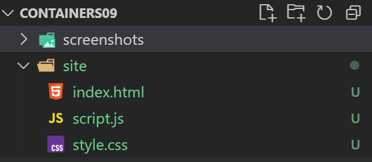
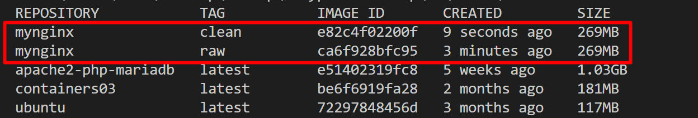

# Лабораторная работа №9. Оптимизация образов контейнеров
## Студент
**Gachayev Dmitrii I2302**  
**Выполнено 01.05.2025**  
## Цель работы
Целью работы является знакомство с методами оптимизации образов.
## Задание
Сравнить различные методы оптимизации образов:
- Удаление неиспользуемых зависимостей и временных файлов
- Уменьшение количества слоев
- Минимальный базовый образ
- Перепаковка образа
- Использование всех методов

# Выполнение
1. Создаю папку `site` и помещаю в нее файлы простейшего сайта (`html, css, js`)



2. Создаю файл `Dockerfile.raw` со следующим содержимым:
```dockerfile
# create from ubuntu image
FROM ubuntu:latest

# update system
RUN apt-get update && apt-get upgrade -y

# install nginx
RUN apt-get install -y nginx

# copy site
COPY site /var/www/html

# expose port 80
EXPOSE 80

# run nginx
CMD ["nginx", "-g", "daemon off;"]
```

3. Собираю образ с именем `mynginx:raw`:
```bash
docker image build -t mynginx:raw -f Dockerfile.raw .
```

## Удаление неиспользуемых зависимостей и временных файлов
1. Удаляю временные файлы и неиспользуемые зависимости в `Dockerfile.clean`:
```dockerfile
# create from ubuntu image
FROM ubuntu:latest

# update system
RUN apt-get update && apt-get upgrade -y

# install nginx
RUN apt-get install -y nginx

# remove apt cache
RUN apt-get clean && rm -rf /var/lib/apt/lists/* /tmp/* /var/tmp/*

# copy site
COPY site /var/www/html

# expose port 80
EXPOSE 80

# run nginx
CMD ["nginx", "-g", "daemon off;"]
```

2. Собираю образ `mynginx:clean` и проверяю его размер:
```bash
docker image build -t mynginx:clean -f Dockerfile.clean .
docker image list
```



на скриншоте видно, что образ `mynginx.raw` почему-то весит так же как образ `mynginx.clean` - 269MB. Хотя по сути, `mynginx.clean` должен весить меньше, потому что в нём после установки пакетов выполняется очистка кэша APT и временных файлов.

## Уменьшение количества слоев