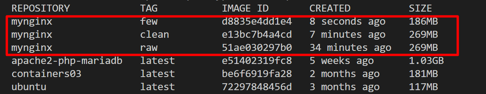
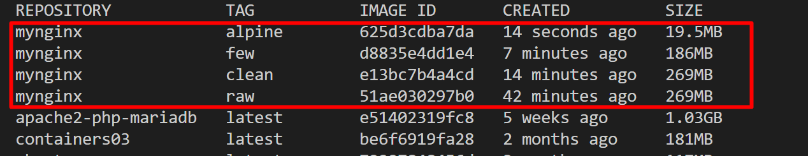
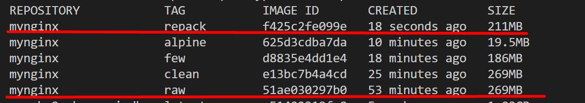
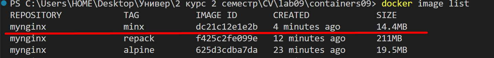
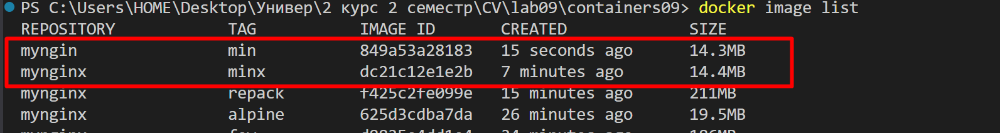
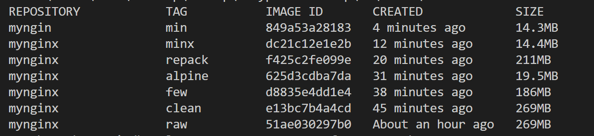

# Лабораторная работа №9. Оптимизация образов контейнеров
## Студент
**Gachayev Dmitrii I2302**  
**Выполнено 01.05.2025**  
## Цель работы
Целью работы является знакомство с методами оптимизации образов.
## Задание
Сравнить различные методы оптимизации образов:
- Удаление неиспользуемых зависимостей и временных файлов
- Уменьшение количества слоев
- Минимальный базовый образ
- Перепаковка образа
- Использование всех методов

# Выполнение
1. Создаю папку `site` и помещаю в нее файлы простейшего сайта (`html, css, js`)


2. Создаю файл `Dockerfile.raw` со следующим содержимым:
```dockerfile
# create from ubuntu image
FROM ubuntu:latest

# update system
RUN apt-get update && apt-get upgrade -y

# install nginx
RUN apt-get install -y nginx

# copy site
COPY site /var/www/html

# expose port 80
EXPOSE 80

# run nginx
CMD ["nginx", "-g", "daemon off;"]
```

3. Собираю образ с именем `mynginx:raw`:
```bash
docker image build -t mynginx:raw -f Dockerfile.raw .
```

## Удаление неиспользуемых зависимостей и временных файлов
1. Удаляю временные файлы и неиспользуемые зависимости в `Dockerfile.clean`:
```dockerfile
# create from ubuntu image
FROM ubuntu:latest

# update system
RUN apt-get update && apt-get upgrade -y

# install nginx
RUN apt-get install -y nginx

# remove apt cache
RUN apt-get clean && rm -rf /var/lib/apt/lists/* /tmp/* /var/tmp/*

# copy site
COPY site /var/www/html

# expose port 80
EXPOSE 80

# run nginx
CMD ["nginx", "-g", "daemon off;"]
```

2. Собираю образ `mynginx:clean` и проверяю его размер:
```bash
docker image build -t mynginx:clean -f Dockerfile.clean .
docker image list
```


На скриншоте видно, что образ `mynginx.raw` весит так же как образ `mynginx.clean` - 269MB. Это связано с тем, что каждая команда `RUN` создаёт новый слой, и старые слои сохраняются как есть, даже если что-то удалить в следующем. Чтобы этого избежать, необходимо объединить все `RUN-команды` в одну, чтобы временные файлы удалились до того, как слой будет зафиксирован и не попали в итоговый образ.

## Уменьшение количества слоев
1. Создаю файл `Dockerfile.few` со следующим содержимым:
```dockerfile
# create from ubuntu image
FROM ubuntu:latest

# update system
RUN apt-get update && apt-get upgrade -y && \
    apt-get install -y nginx && \
    apt-get clean && rm -rf /var/lib/apt/lists/* /tmp/* /var/tmp/*

# copy site
COPY site /var/www/html

# expose port 80
EXPOSE 80

# run nginx
CMD ["nginx", "-g", "daemon off;"]
```
2. Создаю образ с именем `mynginx:few` и проверяю его размер:
```bash
docker image build -t mynginx:few -f Dockerfile.few .
docker image list
```



На скриншоте видно, что образ `mynginx.few` весит меньше остальных - 186MB. Это обусловлено тем, что образ оптимизирован в один слой (одна команда `RUN` вместо 3 отдельных). Это позволяет избежать охранения временных файлов в предыдущих слоях.

## Минимальный базовый образ
1. Создаю файл `Dockerfile.alpine` со следующим содержимым:
```dockerfile
# create from alpine image
FROM alpine:latest

# update system
RUN apk update && apk upgrade

# install nginx
RUN apk add nginx

# copy site
COPY site /var/www/html

# expose port 80
EXPOSE 80

# run nginx
CMD ["nginx", "-g", "daemon off;"]
```
2. Собираю образ с именем `mynginx:alpine` и проверяю его размер:
```bash
docker image build -t mynginx:alpine -f Dockerfile.alpine .
docker image list
```



На скриншоте видно, что образ `mynginx.alpine` весит значительно меньше остальных - 19.5MB. Это обусловлено тем, что он основан на `alpine:latest` - сверхминималистичный дистрибутив Linux, специально созданный для контейнеров.

## Перепаковка образа
1. Перепаковываю образ `mynginx:raw` в `mynginx.repack` и проверяю его размер:
```bash
docker container create --name mynginx mynginx:raw
docker container export mynginx | docker image import - mynginx:repack
docker container rm mynginx
docker image list
```



На скриншоте видно, что образ `mynginx.repack` весит меньше чем `mynginx.raw`, а именно - 211MB. Это достигается за счет перепаковки, а именно получения только одного слоя в конечном итоге и отсутствия временных файлов в перепакованном контейнере.

## Использование всех методов
1. Создаю образ `mynginx:minx` с использованием всех методов:
```dockerfile
# create from alpine image
FROM alpine:latest

# update system, install nginx and clean
RUN apk update && apk upgrade && \
    apk add nginx && \
    rm -rf /var/cache/apk/*

# copy site
COPY site /var/www/html

# expose port 80
EXPOSE 80

# run nginx
CMD ["nginx", "-g", "daemon off;"]
```
2. Создаю образ с именем `mynginx:minx` и проверяю его размер:
```bash
docker image build -t mynginx:minx -f Dockerfile.minx .
docker image list
```



На скриншоте видно, что образ `mynginx.minx` весит, как и ожидалось, меньше всего, потому что в нем используются все методы оптимизации контейнеров, перечисленные выше.

3. Перепаковываю образ `mynginx.minx` в `mynginx.min` и проверяю его размер:

```bash
docker image build -t mynginx:minx -f Dockerfile.min .
docker container create --name mynginx mynginx:minx
docker container export mynginx | docker image import - myngin:min
docker container rm mynginx
docker image list
```



На скриншоте видно, что размер образа не изменился. Это обусловлено тем, что уже оптимизированные образы (использующие `alpine`, `с мин. количеством слоев` и т.д.) не выигрывают от перепаковки. В них изначально нечего вычищать.

## Запуск и тестирование
1. Проверяю размеры всех образов:
```bash
docker image list
```



## Контрольные вопросы:
1. Какой метод оптимизации образов вы считаете наиболее эффективным?
- Я считаю, что метод оптимизации с использованием минимального базового образа `alpine` является самым эффективным. Он даёт наибольшее уменьшение веса при минимальных усилиях и высокой совместимости. Образ `alpine` занимает всего около 5 МБ, по сравнению с десятками мегабайт у `ubuntu`, и при этом позволяет выполнять все базовые задачи.

2. Почему очистка кэша пакетов в отдельном слое не уменьшает размер образа?
- Очистка кэша пакетов в отдельном слое не уменьшает размер образа, потому что каждый `RUN` создаёт новый слой, а данные из предыдущих слоёв сохраняются. Даже если удалить файлы в следующем слое, они останутся в образе и размер не уменьшится

3. Что такое перепаковка образа?
- Перепаковка образа - процесс создания нового Docker-образа путём экспорта файловой системы работающего контейнера и её импорта как одного слоя. В результате образ состоит из одного слоя и содержит только итоговое состояние файлов, без истории слоёв и временного мусора. Это позволяет уменьшить размер образа, особенно если в исходном образе были лишние данные, накопленные на этапах сборки.

## Вывод
В ходе выполненной работы были рассмотрены и протестированы различные методы оптимизации Docker-образов: удаление временных файлов и кэша, уменьшение количества слоёв, использование минимального базового образа `alpine`, перепаковка образа, а также комбинирование всех подходов. На практике подтверждено, что наибольшее уменьшение размера достигается при использовании `alpine` в сочетании с объединением команд в один слой. Перепаковка также даёт результат, но в уже оптимизированных образах она не даёт дополнительного эффекта. Таким образом, грамотное построение Dockerfile и выбор базового образа играют ключевую роль в создании лёгких и эффективных контейнеров.